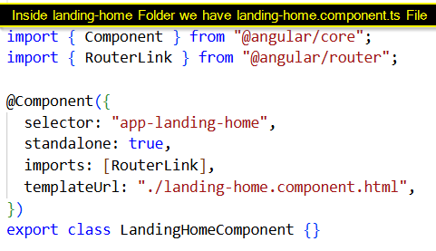
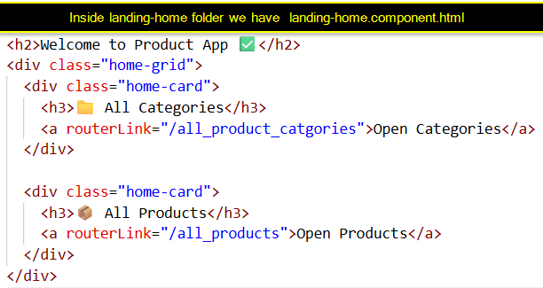

# Angular Components

## 1. What is a Component in Angular?

### Definition

A **Component** in Angular is a **reusable UI block** that controls a part of the screen.

Every component has:

1. A **TypeScript class** → _logic and data 
2. A **HTML template** → _what the user see
3. Optional **CSS styles** → _how it look
4. A **`@Component` decorator** → _tells Angular how to connect all this

You can think of a Component like:

> “One small screen or widget inside your app”  
> Example: Home page, Product list, Product card, 404 page, etc.

### How Components are used in Angular

- **AppComponent** – root component, main shell of the app  
- **Page components** – used for different routes (Home, Products, Categories…)  
- **Reusable components** – small pieces like a product card used many times  

In our **Product Routing App**, each page (Home, All Products, Product Lookup, 404) is a separate component.

---

## 2. Root Component – `AppComponent`

This is the **main / root** component of the entire Angular app.  
Angular puts this inside `<app-root>` in `index.html`.

### 2.1 `app.component.ts`

```ts
// src/app/app.component.ts
import { Component } from '@angular/core';
import { RouterOutlet, RouterLink } from '@angular/router';

@Component({
  selector: 'app-root',
  standalone: true,
  imports: [RouterOutlet, RouterLink],
  templateUrl: './app.component.html',
  styleUrls: ['./app.component.css'],
})
export class AppComponent {
  appName = 'Angular Product Routing Demo';
}
```

**What is happening here?**

- `@Component({...})` → tells Angular this class is a Component.

- `selector: 'app-root'` → in HTML we can use `<app-root></app-root>`.

- `standalone: true` → this component does not need an NgModule (new style).

- `imports: [RouterOutlet, RouterLink]` → this component’s template can use:

- `<router-outlet>` – where routed pages will appear

- `routerLink` – for navigation links

- appName → a property on the class, used in the HTML template.


**`app.component.html`**

<!-- src/app/app.component.html --> 

```js
<header class="app-header">
  <h1>{{ appName }}</h1>

  <nav>
    <a routerLink="/">Home</a> |
    <a routerLink="/all_products">All Products</a> |
    <a routerLink="/all_product_catgories">All Categories</a>
  </nav>
</header>

<hr />

<main class="app-content">
  <!-- Routed pages will be rendered here -->
  <router-outlet></router-outlet>
</main>
```

**What is happening here?**

- `{{ appName }}` → shows the `appName` value from `AppComponent` class.

- `routerLink="/"` → clicking “Home” loads the component mapped to /.

- `<router-outlet>` → Angular injects the current page component here based on URL.

**Result in our project**

- `AppComponent` wraps all other pages.

- Header (title + menu) is always visible.

Inside `<router-outlet>` Angular shows.

- Home page

- All Products page

- Categories page

- Product Lookup page

- 404 page
depending on the current URL.


**Page Component** – Home / Landing Page

- This is the first screen when user opens the app.

**landing-home.component.ts**

`// src/app/pages/landing-home/landing-home.component.ts`

 #### `landing-Home page ScreenShot` : 

- `import { Component } from '@angular/core';`

 - Brings the `Component` symbol from Angular core library.

 - We need this to create an Angular component using `@Component(...)`.

- `import { RouterLink } from '@angular/router';`

 - Brings `RouterLink` directive.

 - This lets us use `routerLink` in the HTML (for navigation links like /all_products).

## This is a configuration object that tells Angular:

- `selector: 'app-landing-home'`

 - This is the HTML tag for this component.

 - We can use it like:

`<app-landing-home></app-landing-home>`


- `standalone: true`

 - This means the component is standalone Angular 15+ style.

 - It does not need to be declared inside an `NgModule`.

- `imports: [RouterLink]`

 - This tells Angular:

 - “Inside this component’s HTML, I want to use `routerLink` directive.”

- So in `landing-home.component.html` you can write:

`<a routerLink="/all_products">All Products</a>`


- `templateUrl: './landing-home.component.html'`

 - This points to the HTML file for this component.

 - All the UI for this page is in landing-home.component.html.

- `export class LandingHomeComponent { ... }`

 - This defines the component class.

 - The class holds the data and logic for the page.

- `title = 'Welcome to the Product App';`

 - This is a property of the component.

 - In HTML, you can show it with interpolation **{{ title }}**

 - Output will be: `Welcome to the Product App`

- `introText = 'Use the links below to explore products and categories.';`


**What this shows about components**

- Component can hold text/data (title, introText).

- It can import RouterLink to create navigation links in the template.


**landing-home.component.html**

<!-- src/app/pages/landing-home/landing-home.component.html -->

 #### `landing-Home page ScreenShot` : 

- <h2>...</h2> → HTML heading tag (slightly smaller than <h1>).

- {{ title }} → this is Angular interpolation.

- It takes the value from the TypeScript class:

  - **title = 'Welcome to the Product App';**

- And displays it in the browser.

- So on screen, this line becomes:

Welcome to the Product App as a Heading 

### <p>{{ introText }}</p>

`<p>...</p>` → normal paragraph tag in HTML.

`{{ introText }}` → again interpolation from the class:

```js
introText = 'Use the links below to explore products and categories.';
```

- Angular replaces `{{ introText }}` with that string.

- you will see a paragraph like Use the links below to explore products and categories.

### <a routerLink="/all_products">All Products</a>

- `<a>...</a>` → normally an anchor (link) in HTML.

- But here, instead of href, we use routerLink (Angular directive).

`routerLink="/all_products"`


- This tells Angular Router

 - “When the user clicks this link, navigate to `/all_products route`.”

- No full page reload happens. Angular just loads the component mapped to that URL  `ProductsComponent`.

On screen, it looks like a clickable link `All Products`

- <a routerLink="/all_product_catgories">All Categories</a>

Same idea as above:
```js
routerLink="/all_product_catgories"
```

When clicked, Angular routes to `/all_product_catgories`.

That URL is mapped (in `app.routes.ts`) to AllCategoriesComponent.

On screen, you see another link `All Categories`

**How it is useful in Angular**

This component is mapped to / in app.routes.ts.

- It is a page-level component (one full screen).

- It helps user navigate to other parts of the app.


## Reusable Component – Product Card

- Instead of writing card HTML inside `ProductsComponent`,
- we can create a `reusable component` to display a single product.

// src/app/pages/product-card/product-card.component.ts
```js
import { Component, Input } from '@angular/core';
import { CommonModule } from '@angular/common';
import { RouterLink } from '@angular/router';
import { Product } from '../../models/product.model';

@Component({
  selector: 'app-product-card',
  standalone: true,
  imports: [CommonModule, RouterLink],
  templateUrl: './product-card.component.html',
  styleUrls: ['./product-card.component.css'],
})
export class ProductCardComponent {
  @Input() product!: Product;
}
```
**What this shows**

- @Input() → parent component can pass data to this child component.

- Component becomes `reusable` for different products.


