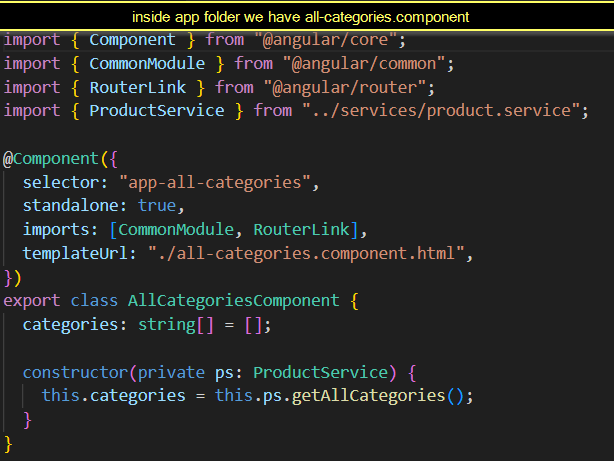
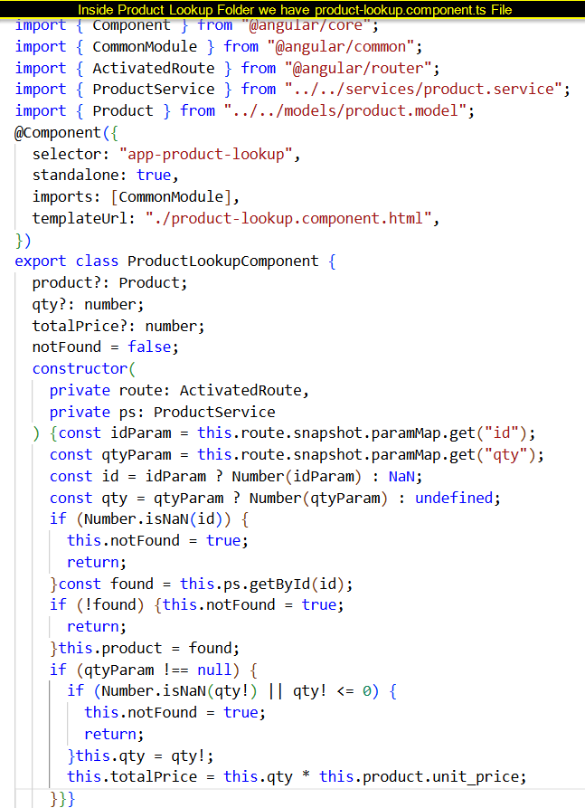
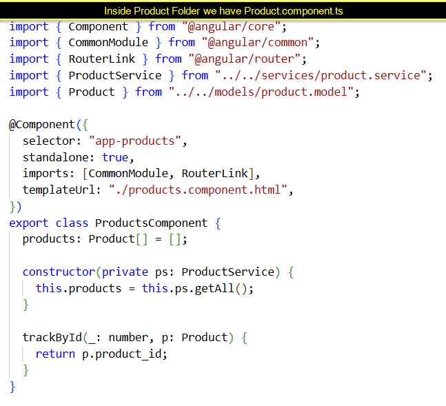
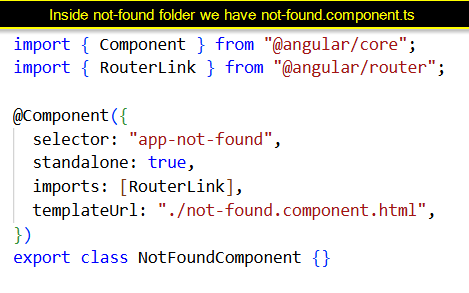

# Angular Routing Tutorial

## 1) What is Routing in Angular?

- `Routing in Angular` is the feature that allows us to build a multi-page application inside a single page.

- It means when the browser URL changes, Angular `does not reload the full page`, instead it `loads a specific component` in the same SPA.

- Routing helps users move between different screens like Home, Products, Categories, Product Details etc., purely based on URL patterns.


## Angular Routing Tutorial (Product Lookup Project)

This file explains **Routing** in Angular using **our Product project**  
with URLs like:

- `/all_products`
- `/all_product_catgories`
- `/all_product_catgory/frozen`
- `/product_lookup/25`
- `/product_lookup/23/5`
- `/not-found`
- `/**` (wildcard → 404)


## What is a Route?

- A `Route` is `one single rule` in the routing configuration that defines the 

`which URL` path Angular should listen for `which component` should be displayed for that path

So a route is like a `connection` between a URL and a page component.

## Example routes from app.routes.ts

```js
{ path: "", component: LandingHomeComponent },
{ path: "all_product_catgories", component: AllCategoriesComponent },
{ path: "all_products", component: ProductsComponent },
{ path: "all_product_catgory/:category", component: CategoryProductsComponent },
{ path: "product_lookup/:id", component: ProductLookupComponent },
{ path: "product_lookup/:id/:qty", component: ProductLookupComponent },
{ path: "not-found", component: NotFoundComponent },
{ path: "**", redirectTo: "not-found" }
```


##  Where is Routing Code Written? (`app.routes.ts`)

All our routes are written in **one file**:

> **File:** `src/app/app.routes.ts`

###  Import Section (Components used by routes)

// src/app/app.routes.ts

```ts 
import { Routes } from "@angular/router";

import { LandingHomeComponent } from "./pages/landing-home/landing-home.component";
import { AllCategoriesComponent } from "./pages/all-categories/all-categories.component";
import { ProductsComponent } from "./pages/products/products.component";
import { CategoryProductsComponent } from "./pages/category-products/category-products.component";
import { ProductLookupComponent } from "./pages/product-lookup/product-lookup.component";
import { NotFoundComponent } from "./pages/not-found/not-found.component";
```
### Code explanation :

- `import` means bring this thing into this file so we can use it.

- First we bring `Routes` type from Angular Router.

- we bring all the **components** that we will use in routes.

Example:

`LandingHomeComponent` lives in the file `landing-home.component.ts` inside the `pages/landing-home folder`.

Very important rule:
**If a component is used in a route, it must be imported here.**


1. `Component file` : **src/app/pages/landing-home/landing-home.component.ts**

`{ path: "", component: LandingHomeComponent }`

- URL: `/`

- Component: `LandingHomeComponent` (imported at the top)

- This is our **home** route.

- #### `Home page ScreenShot` : 


### Code Explanation part :

`path: ""` → this is the **root URL**: `http://localhost:4000/`

- When user opens the app without anything after the domain, Angular uses this rule.

- It shows LandingHomeComponent on the screen.

So you can read this line as:
- “For `/,` display LandingHomeComponent.”


### 2 `Component File` :**src/app/pages/all-categories.component.ts**

- { path: **"all_product_catgories"**, component: AllCategoriesComponent } 

- URL: `/all_product_catgories`

- Component: `AllCategoriesComponent` (imported above)

- Shows all **product categories**.


### Code Explanation part :

- This is a `static` (fixed) route the URL is always `/all_product_catgories.`

- When the URL matches exactly **/all_product_catgories**, Angular shows `AllCategoriesComponent`.

- That component displays the list of `all product categories`.


### 3. `Component File` : **src/app/pages/all_categories_.component.ts** 

`{ path: "all_product_catgory/:category", component: CategoryProductsComponent }`

- URL pattern: `/all_product_catgory/<categoryName>`

Example: `/all_product_catgory/FROZEN` or `/all_product_catgory/FRUITS`

`:category` is a **route parameter** (dynamic part of URL).

- Component: `CategoryProductsComponent`

- Uses `category` param to filter products.


### Code Explanation:

- This is a **dynamic** route because of :category.

- `:category` is a **route parameter** it acts like a variable in the URL.

Example URLs that match this route:

 - /all_product_catgory/FROZEN

 - /all_product_catgory/FRUITS

- Angular reads the value for `:category` from the URL and passes it to `CategoryProductsComponent`.

Inside the component, we can use that value to **filter products** and show only that category.

### 


### 4. `Component File` : **src/app/pages/product-lookup/product-lookup.component.ts**

`{ path: "product_lookup/:id", component: ProductLookupComponent }`

- URL pattern: `/product_lookup/<id>`

Example: `/product_lookup/25`

- `:id` is a **route parameter**.

- Component: ProductLookupComponent

- Shows one product with that ID, no quantity.

### Code Explanation :

- Both routes use the `same component`: **ProductLookupComponent**.

- First route:

  - URL like `/product_lookup/25`

 - `:id` is the product ID.

 - Component shows details of that product.

- Second route:

 - URL like `/product_lookup/23/5`

 - `:id` is product ID, :qty is quantity.

 - Component can show **total price = price × qty** or similar.

- Good design: one component handles both cases, so no duplicate code.

### `product lookup screenshot` 


### 5. `Component File` : **src/app/pages/products/products.component.ts**

`{ path: "all_products", component: ProductsComponent }`

- URL: `/all_products`
- Component: `ProductsComponent`
- This page shows the list of **all products** in our project.

#### `Products page screenshot` :  


### Code Explanation part :

- This is a **static (fixed) route**.
- The URL is always `/all_products` (it does not change).
- When the URL in the browser matches `/all_products`, Angular uses this rule.
- It loads the `ProductsComponent` and displays **all products** from the product list.
- Same URL → same component → same type of page every time.


### 6. `Component File` : **src/app/pages/product-lookup/product-lookup.component.ts**

`{ path: "product_lookup/:id/:qty", component: ProductLookupComponent }`

- URL pattern: `/product_lookup/<id>/<qty>`
- Example: `/product_lookup/23/5`
  - `id = 23`
  - `qty = 5`
- Component: `ProductLookupComponent`

### Code Explanation :

- This is also a **dynamic route**, but it has **two route parameters**: `:id` and `:qty`.
- Angular reads both values from the URL:
  - `id` → which product
  - `qty` → how many units
- Inside `ProductLookupComponent`, we can:
  - load the product by `id`
  - use `qty` to calculate **total price** or show “You selected 5 items”.
- Same component (`ProductLookupComponent`) handles:
  - `/product_lookup/:id`
  - `/product_lookup/:id/:qty`
  so we **avoid duplicate code**.


### 7. `Component File` : **src/app/pages/not-found/not-found.component.ts**

`{ path: "not-found", component: NotFoundComponent }`

- URL: `/not-found`
- Component: `NotFoundComponent` (our 404 page).

### `notfound screenshot`  


### Code Explanation part :

- This route is used to show the **404 – Page Not Found** screen.
- The URL `/not-found` is a **static** URL (it never changes).
- Whenever Angular needs to show an error page, it can navigate to `/not-found`.
- We also use this together with the wildcard route:

`{ path: "**", redirectTo: "not-found"}`
-  If the user types a wrong / unknown URL,

- Angular will redirect to /not-found, and this NotFoundComponent will be displayed.

 ***Important***
Every component we use in a route `must be imported` at the top of app.routes.ts.

### For example:

- Route uses `AllCategoriesComponent` → we must have
`import { AllCategoriesComponent } from "./pages/all-categories/all-categories.component";`


##  Routes Array All URL → Component mappings

```js
// src/app/app.routes.ts

export const routes: Routes = [
  // Home page
  { path: "", component: LandingHomeComponent },

  // Static pages
  { path: "all_product_catgories", component: AllCategoriesComponent },
  { path: "all_products", component: ProductsComponent },

  // Dynamic: Category-based products
  { path: "all_product_catgory/:category", component: CategoryProductsComponent },

  // Dynamic: Product lookup by ID and with quantity
  { path: "product_lookup/:id", component: ProductLookupComponent },
  { path: "product_lookup/:id/:qty", component: ProductLookupComponent },

  // Not found + wildcard 
  { path: "not-found", component: NotFoundComponent },
  { path: "**", redirectTo: "not-found" }
];
```

- This routes array is the main part in our app.

- Angular reads this array and uses it to decide which component to show for which URL.

## What is the Routes Array?

- The Routes `array` is a `list of all routes` in the app.

- Angular reads this array `from top to bottom` and tries to match the current URL.

- It is written inside `app.routes.ts`

```js
// src/app/app.routes.ts

export const routes: Routes = [
  { path: "", component: LandingHomeComponent },
  { path: "all_product_catgories", component: AllCategoriesComponent },
  { path: "all_products", component: ProductsComponent },
  { path: "all_product_catgory/:category", component: CategoryProductsComponent },
  { path: "product_lookup/:id", component: ProductLookupComponent },
  { path: "product_lookup/:id/:qty", component: ProductLookupComponent },
  { path: "not-found", component: NotFoundComponent },
  { path: "**", redirectTo: "not-found" }  
];
```


- All URLs like /all_products, /all_product_catgories, /product_lookup/:id are stored in this array.


## Regular / Static Routing What is Regular Routing?

- **Regular / Static routing** means routing with fixed URLs

- The URL `never changes structure`.

- There are `no parameters`.

- Whenever you open that static URL, you always get the `same component`.

**Static URLs in our project**

- `/` → `LandingHomeComponent`

- `/all_products` → `ProductsComponent`

- `/all_product_catgories` → `AllCategoriesComponent`

`/not-found` → `NotFoundComponent`

From `app.routes.ts`

```js
{ path: "", component: LandingHomeComponent },
{ path: "all_product_catgories", component: AllCategoriesComponent },
{ path: "all_products", component: ProductsComponent },
{ path: "not-found", component: NotFoundComponent },
```


## Dynamic Routing What is Dynamic Routing?

- **Dynamic routing** means the URL contains a variable part that can change.

- Angular represents these variables using route parameters written with 

- This allows one component to handle many similar URLs.

**Dynamic URLs in our project**

- `/product_lookup/1`, `/product_lookup/25`, `/product_lookup/20`

`/product_lookup/23/5`, `/product_lookup/21/2`

`/all_product_catgory/FROZEN`, `/all_product_catgory/FRUITS`

`File: src/app/app.routes.ts`

```js
{ path: "all_product_catgory/:category", component: CategoryProductsComponent },
{ path: "product_lookup/:id", component: ProductLookupComponent },
{ path: "product_lookup/:id/:qty", component: ProductLookupComponent },
```

- `:category`, `:id`, `:qty` are dynamic route parameters.

## Route Parameter What is a Route Param?

- A route parameter is the dynamic value inside the URL.

- Angular extracts this value and we use it inside the component to load the correct data.

- Route params are mandatory for that route without URL won’t match that pattern.

## Example: Product ID in URL

URL:
```js
/product_lookup/25
```

Here:

- param name = id

- param value = 25

Route:

**File**  `src/app/app.routes.ts`
```js
{ path: "product_lookup/:id", component: ProductLookupComponent }
```

Read inside TypeScript:
```js
File: src/app/pages/product-lookup/product-lookup.component.ts
```

```js
const idParam = this.route.snapshot.paramMap.get("id");
const id = Number(idParam);

const found = this.ps.getById(id);
```

- `this.route.snapshot.paramMap.get("id")` reads the id from the URL.

- `this.ps.getById(id)` calls `ProductService` to fetch that product.


## routerLink What is routerLink?

- `routerLink` is a **directive** used in HTML templates to navigate between routes.

It creates `Angular-controlled links`, so clicking them

- changes the URL

- loads the new component without full browser reload.


## Example Top Navbar

- `File: src/app/app.component.html`

```js
<nav>
  <a routerLink="/">Home</a> |
  <a routerLink="/all_products">All Products</a> |
  <a routerLink="/all_product_catgories">All Categories</a>
</nav>
```

- Clicking **All Products** → URL becomes `/all_products` → `ProductsComponent`


## Example – Categories Page

- `File: src/app/pages/all-categories/all-categories.component.html`

```js
<li *ngFor="let c of categories">
  <a [routerLink]="['/all_product_catgory', c]">
    {{ c }}
  </a>
</li>
```

- Click `FROZEN` → URL becomes `/all_product_catgory/FROZEN`

- `CategoryProductsComponent` uses `category` param to filter products.


## Router.navigate / navigateByUrl Programmatic Navigation

- Sometimes we must navigate from `TypeScript code`, not just by clicking a link.

- This is called `programmatic navigation`.
- We use it when routing decisions depend on logic (validation, login, data existence, etc.)

## Example from our project Product not found

- `File: src/app/pages/product-lookup/product-lookup.component.ts`
```js
if (!found) {
  this.router.navigateByUrl("/not-found");
}
```

- URL `/product_lookup/30` (no product 30)
- → code runs `navigateByUrl("/not-found")`
- → user is taken to NotFound page.

## Redirect (What is Redirect Routing?)

- Redirect routing

- When user opens one URL, Angular `automatically sends` them to a different URL.

Useful for

- default routes

- old URLs

- error handling

## We use redirect for unknown URLs:

- `File: src/app/app.routes.ts`

```js
{ path: "**", redirectTo: "not-found" }
```

- Any URL not defined above will redirect to /not-found.


## Wildcard Route (What is Wildcard **?)

- `**` is a `special wildcard route` that matches `any URL` that did not match earlier routes.

- Mainly used for `404` handling.

- Because Angular checks routes in order, `wildcard must always be LAST`.

In our project:

- `File: src/app/app.routes.ts`

```js
{ path: "**", redirectTo: "not-found" }
```

- `/xbyz` → not matching any route → wildcard triggers → redirect to /not-found


## 404 Page Handling (What is 404 Handling?)

- `404 handling` means showing a `“Page Not Found”` component whenever:

- URL doesn’t exist

- product id is invalid

- category name is invalid

We do this using

- `NotFoundComponent`

- Wildcard route + redirects

- Optional programmatic navigation in components 

 **Wildcard + NotFound**

`File: src/app/app.routes.ts`
```js
{ path: "not-found", component: NotFoundComponent },
{ path: "**", redirectTo: "not-found" }
```

## How to Run App on Port 4000 (So URLs Match Tutorial)

- By default, Angular CLI uses port `4200`.
- We are using URLs with port 4000:

```js
http://localhost:4000/all_products
```
```js
http://localhost:4000/all_product_catgories
```

## **Run with --port (CLI command)**

**Command (terminal, not a file)**
```js
ng serve --port 4000
```

## Set port in package.json (so everyone uses 4000)

`File: package.json`
```js
{
  "scripts": {
    "start": "ng serve --port 4000"
  }
}
```
- Then, on any system:
```js
npm start
```
- The Angular app will run at:

```js
http://localhost:4000
```

