## 🖼️ Angular Project Structure – Screenshot Index

<!-- 1. **Overall Angular Workspace**
   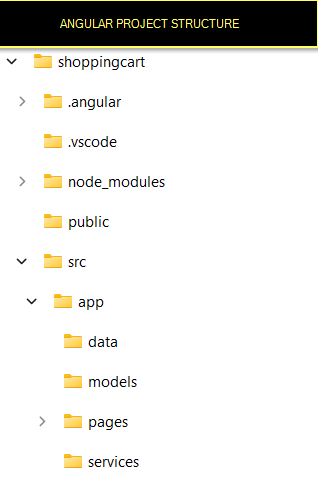

2. **Project Structure (View 1)**
   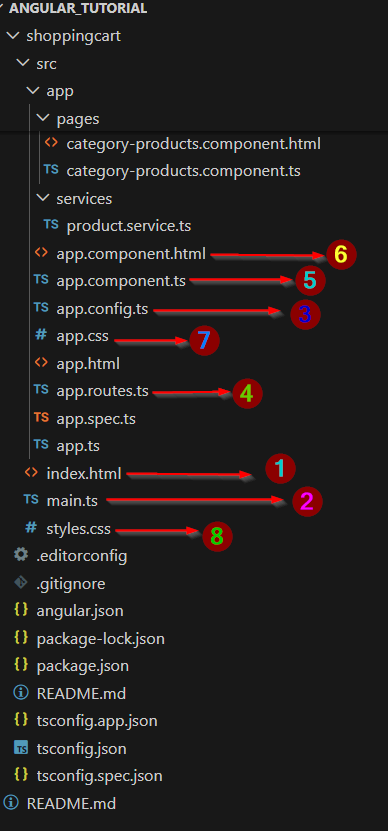 -->

<!-- 3. **Project Structure (View 2)**
   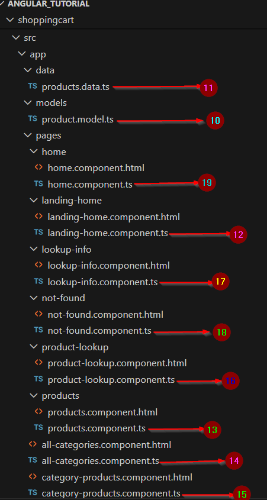 -->

  

4. **Shopping Cart Project Structure**
   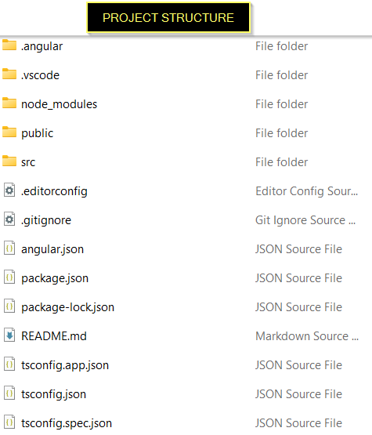

5. **Inside `src` Folder**
   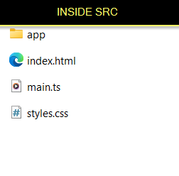

6. **Inside `app` Folder**
   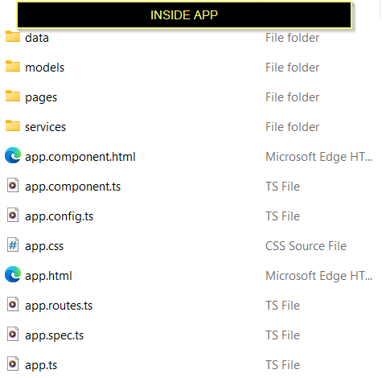

7. **Inside `page` Folder**
   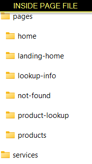

8. **Inside `home` Folder**
   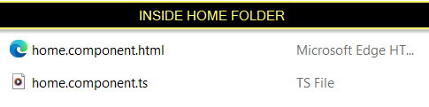

9. **Inside `landing-home` Folder**
   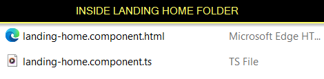

10. **Inside `lookup` Folder (Info Page)**
    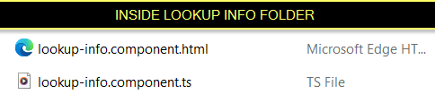

11. **Inside `product-lookup` Folder**
    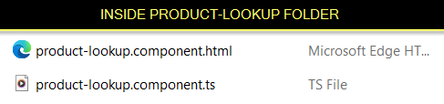

12. **Inside `not-found` Folder**
    

13. **Inside `products` Folder – File Explorer View**
    

